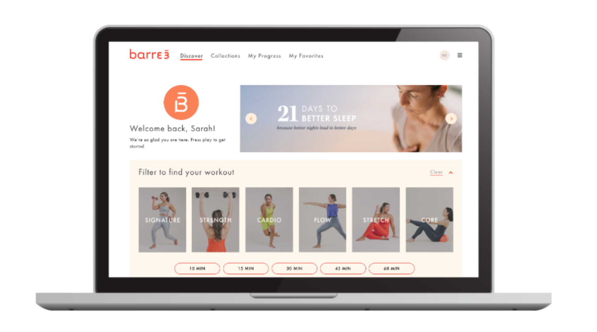
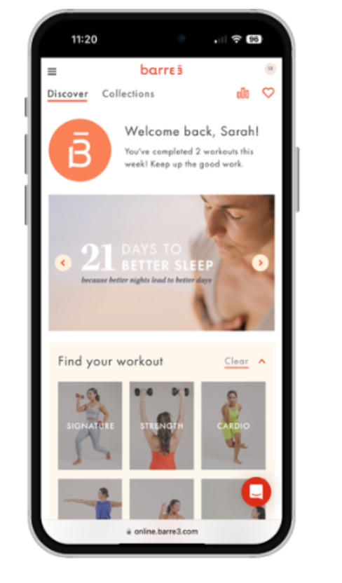

The Discover page (essentially the homepage to the online subscription) was revamped from top to bottom to design for user flow and utilization.

The Discover page (essentially the homepage to the online subscription) was revamped from top to bottom to design for user flow and utilization.

Similarly, the new filter results page features the same redesigned filter at the top, so that users can quickly calibrate their choices and refine their selections at a glance.

Similarly, the new filter results page features the same redesigned filter at the top, so that users can quickly calibrate their choices and refine their selections at a glance.

The entire redesign was designed to be extremely user-friendly, while keeping the desktop experience as a priority, since barre3’s data indicates that most of our users work out using a desktop device.

As the sole digital product designer at barre3, I was responsible for the wire framing, UI, and prototyping of this project, in tandem with the product and engineering team.
