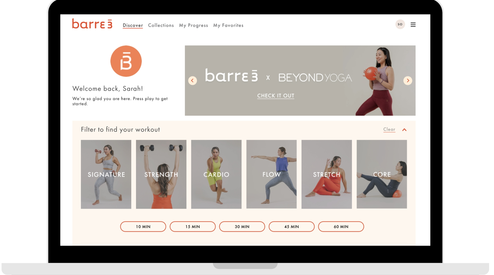
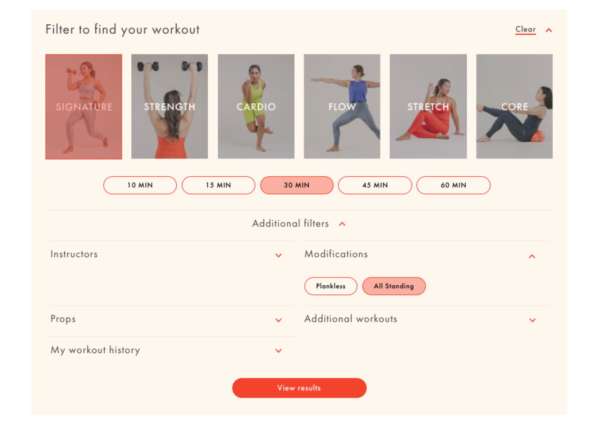
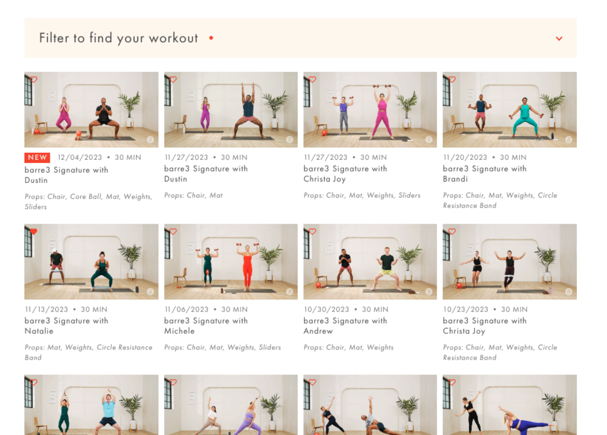
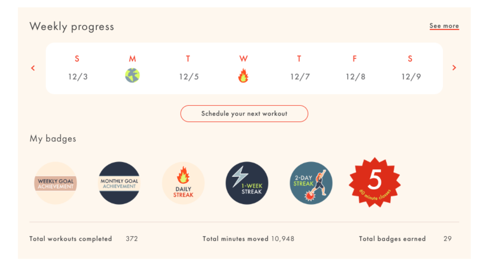

import { Image } from 'astro:assets'
import image5 from './Image5.jpg'

The Discover page (essentially the homepage to the online subscription) was revamped from top to bottom to design for user flow and utilization.

Filtering is the most utilized feature of the experience, but previously, the option to filter was hidden underneath a small icon in a sidebar. When redesigning, I prioritized making the filter front and center so that users could quickly find their preferred workout.

Similarly, the new filter results page features the same redesigned filter at the top, so that users can quickly calibrate their choices and refine their selections at a glance.

Additionally during the redesign, I created a new section highlighting a user’s progress and achievements, encouraging motivation and reward to increase retention and engagement.

  <Image
    src={image5}
    alt=""
    class="mx-auto w-72"
  />
  

   

  The entire redesign was designed to be extremely user-friendly, while keeping the desktop experience as a priority, since barre3’s data indicates that most of our users work out using a desktop device.

   

  As the sole digital product designer at barre3, I was responsible for the wire framing, UI, and prototyping of this project, in tandem with the product and engineering team.
  

