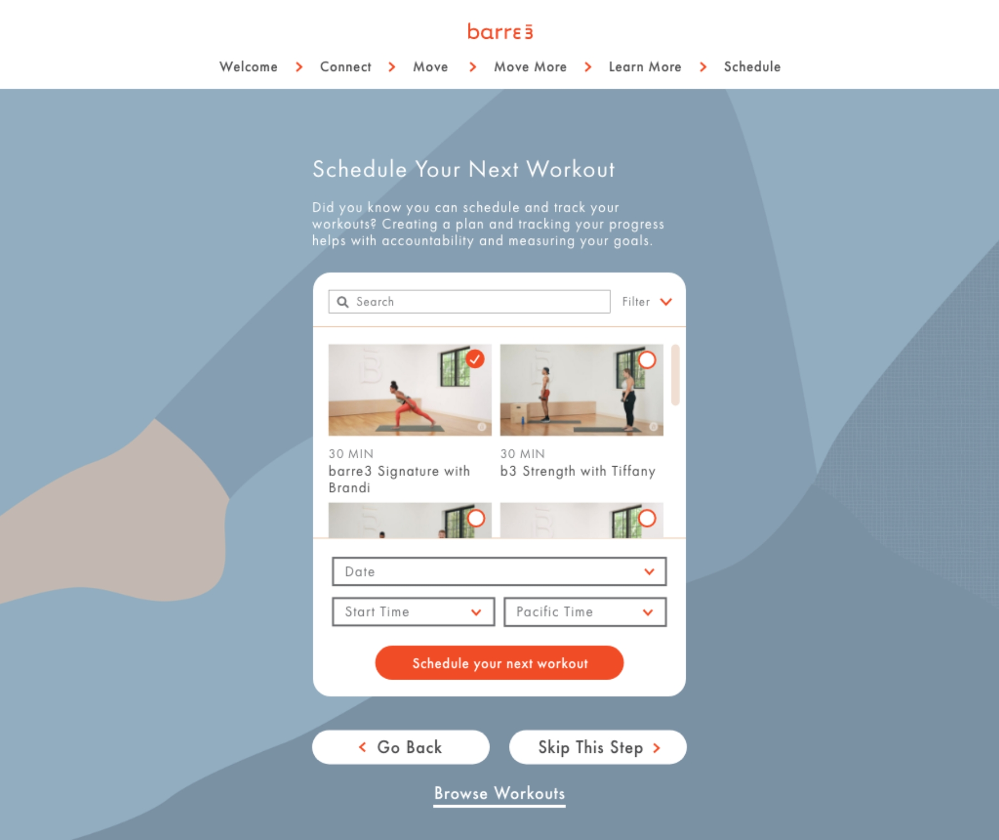

I designed the new onboarding flow to be highly navigable. Although the primary focus and content is featured within the center module, the user has the option to toggle between the pages of the experience, or skip ahead entirely to the homepage of the subscription (browse workouts).

Including breadcrumbs in the six-page experience was essential to user wayfinding, and a new design component for barre3 online. Above are some of the options I explored before landing on the final design.

We created a scheduling module as a final step, with the goal of increasing user retention encouraged by our pairing email cadence.

This project was also an excellent opportunity to exercise my prototyping skills. Because each of the modules interacted intricately with one another, this was key in the designer to developer handoff – as well as a detailed spec sheet outlining the nitty gritty of spacing and sizing use cases throughout the experience.
