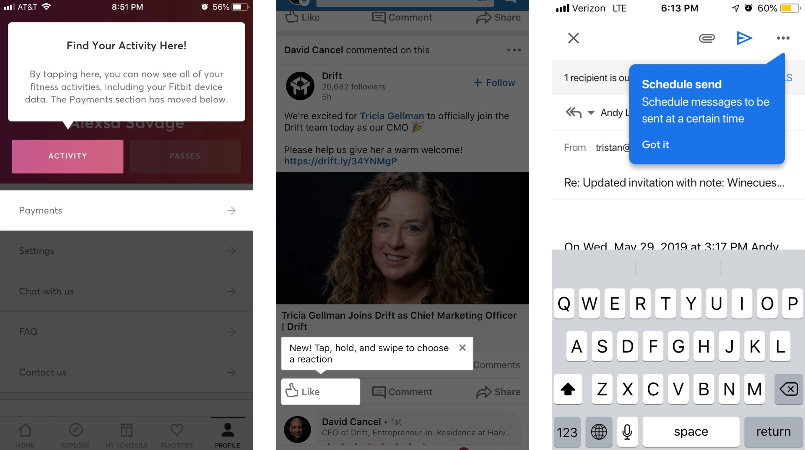
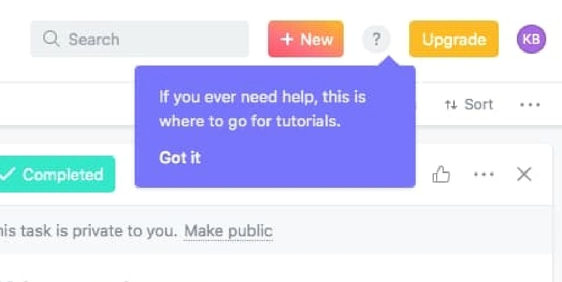
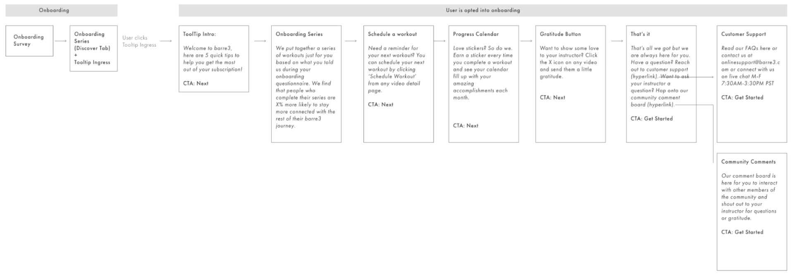
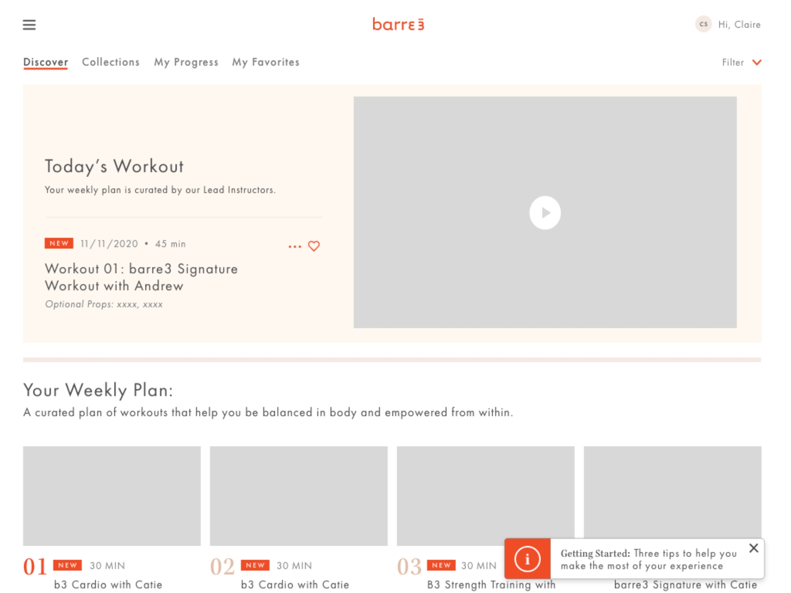
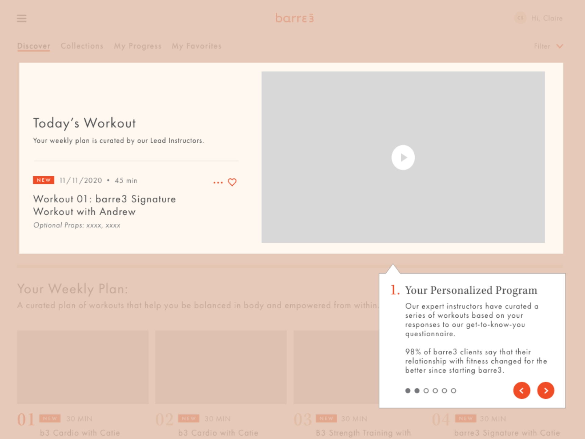
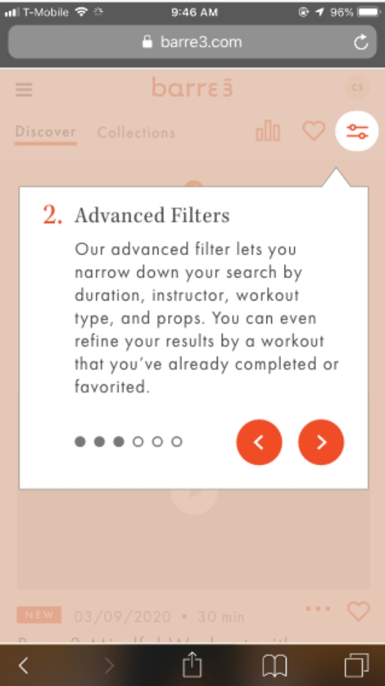
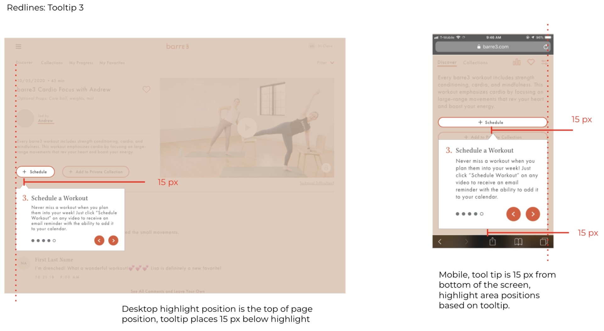

  

  I started first with competitive analysis and inspiration for tooltip design. Examples on both desktop and mobile tended to highlight focus areas and use interruptive text overlays to communicate blurbs of information with a friendly, eye-catching design.
  

  

  
  

I worked with the Senior UX Designer on different user flows to highlight different features based on a user’s journey: motivational + accountability features for those opted into our onboarding program, and new discovery paths for those not opted in.

_Note: designs above are from my wireframes and do not reflect shipped product (see “results” for more information)_

We started with an ingress point that would present after a user completed or opted out of the onboarding questionnaire, and would only show up on the homepage.

Once the ingress point was engaged with, the tooltips flow would begin. I designed these to fit within barre3’s existing design system, creating progress indicators and friendly circle toggles to navigate the flow.

  

  
  

  

  These were designed to be mobile-friendly and highly interactable – if a user engaged with the highlighted item they could later return to the tooltips flow at any time using the same ingress point on the homepage. 
  Because of the nature of these tooltips being very flexible to the design of our existing site and the changing content within it, the UX designer and I created a 33 pages developer functionality slide deck redlining any potential design pitfalls and addressing any potential edge case functionality.
  

I prototyped the final flow using Adobe XD for approval by the product manager + head of digital product at barre3. Although many aspects of this project were never fully built, it was an extremely useful exercise in expanding barre3’s design system – many of these components would end up being utilized in future design projects during my tenure.
